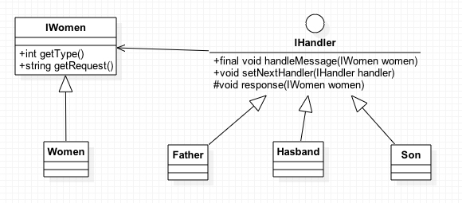

#DesignPatters
=============
Recently , I try to study and use more DesignPatters,so I will commit sum my prictices.so..
##1.Chain of responsibility
古代女子三从四德，本责任链模式code以此为场景。
类图如下:
 
责任链模式重点是在链上，有一条链处理相似的请求，在链中决定谁来处理这个请求，并返回相应的结果。
